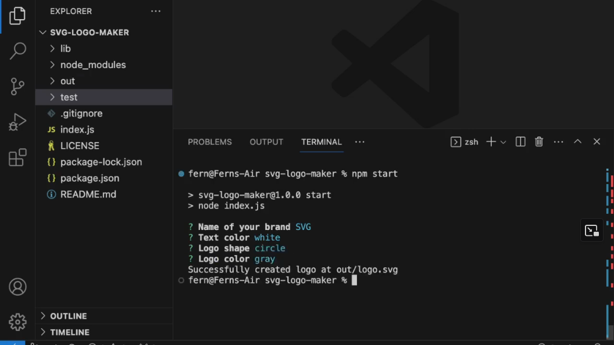

# SVG Logo Maker

 
 
A command line interface tool that allows you to quickly generate a logo for your products or projects. Easy to use with the help of the inquirer library. Be able to make a background with different shapes and colors and text with a multitude of colors.

Walkthrough: 

## Generated Samples

 
## Table Of Contents
1. [Installation](#installation)
2. [Usage](#usage)
3. [License](#license)
4. [Contributing](#contributing)
5. [Tests](#tests)
6. [Questions](#questions)
 
### Installation
 
Make sure that Node v18.18.0 or greater is installed on your system. Then clone this repository. Before running the program, do `npm install` to download the required dependenies. Optionally, run `npm test` to test the program and detect any bugs.
 
### Usage
 
To start the program, type `npm start` and press enter. You will be prompted with a series of questions that will describe the look of the logo. Once finished, your logo SVG file is generated to the `out` directory.
 
### License
 
 

This project in under the MIT license. Learn more about it here: https://opensource.org/licenses/MIT
 
### Contributing
 
A couple of rules if you wish to contribute. Follow the same formatting when making javascript code. Make descriptive commits outlining the process of creating a new feature. Lastly, ask to merge to the `develop` branch when creating a pull request.
 
### Tests
 
As mentioned in the installation instructions, run tests by typing `npm test`.
 
### Questions
 
What is the link to my GitHub?
 
- Link to my GitHub profile: [https://github.com/elmfer](https://github.com/elmfer)
 
How can you contact me?
 
- Contact me through my email: [elmfer10@gmail.com](mailto:elmfer10@gmail.com)
